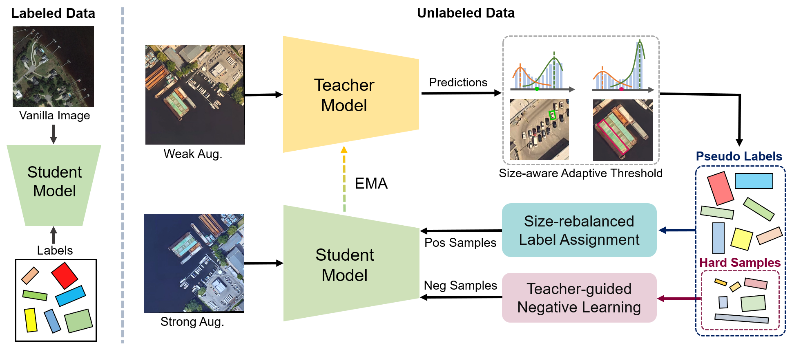
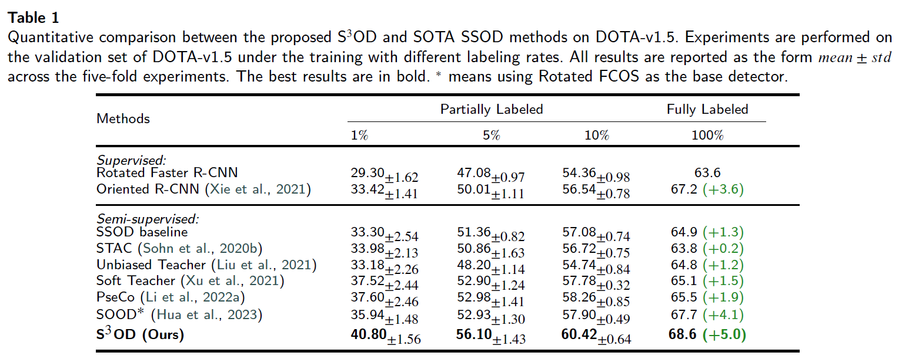
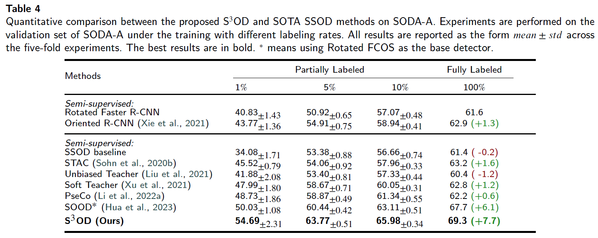
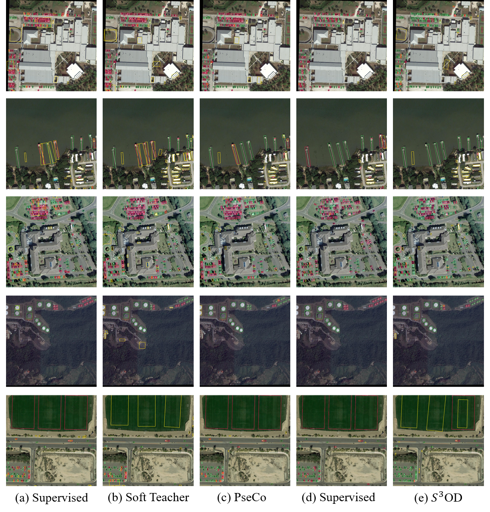

# S $^3$ OD: Size-unbiased Semi-Supervised Object Detection in Aerial Images


This repo is the official implementation of paper "S $^3$ OD: Size-unbiased Semi-Supervised Object Detection in Aerial Images"


## Introduction

S $^3$ OD is a semi-supervised object detection framework tailed for aerial images object detection.


### Requirements
- Ubuntu 16.04
- Python 3.7
- PyTorch 1.10.1
- CUDA 11.3.1
- MMdet 2.25.3
- MMrotate 0.3.0

<!-- ### Notes
- We use [wandb](https://wandb.ai/) for visualization, if you don't want to use it, just comment line `273-284` in `configs/soft_teacher/base.py`.
- The project should be compatible to the latest version of `mmdetection`. If you want to switch to the same version `mmdetection` as ours, run `cd thirdparty/mmdetection && git checkout v2.16.0` -->

### Installation
Note that this repository is based on the Soft-Teacher, MMdetection,MMRotate. Assume that your environment has satisfied the above requirements, please follow the following steps for installation.

```
git clone https://github.com/ZhangRuixiang-WHU/S3OD/tree/master
cd s3od
pip install -r requirements/build.txt
cd thirdparty/mmdetection
pip install -v -e .
cd ../mmrotate
pip install -v -e .
cd ../../
pip install -v -e .
```

### Main Results

Results on DOTA-v1.5



Results on SODA-A



### Visualization



<!-- ### Data Preparation
- Download the COCO dataset
- Execute the following command to generate data set splits:
```shell script
# YOUR_DATA should be a directory contains dota dataset.
# For eg.:
# YOUR_DATA/
#  dota1.5/
#     train_obb/
#     val_obb/
#     test_obb/
ln -s ${YOUR_DATA} data
bash tools/dataset/prepare_coco_data.sh conduct

```
For concrete instructions of what should be downloaded, please refer to `tools/dataset/prepare_coco_data.sh` line [`11-24`](https://github.com/microsoft/SoftTeacher/blob/863d90a3aa98615be3d156e7d305a22c2a5075f5/tools/dataset/prepare_coco_data.sh#L11) -->
### Training
- To train model on the **partial labeled data** setting:
```shell script

# PERCENT_LABELED_DATA: 1, 5, 10. The ratio of labeled coco data in whole training dataset.
# GPU_NUM: number of gpus to run the job
for FOLD in 1 2 3 4 5;
do
  bash tools/dist_train_partially.sh ${FOLD} <PERCENT_LABELED_DATA> <GPU_NUM>
done
```
For example, we could run the following scripts to train our model on 10% labeled data with 1 GPUs:

```shell script
for FOLD in 1 2 3 4 5;
do
  bash tools/dist_train_partially.sh ${FOLD} 10 1
done
```

<!-- - To train model on the **full labeled data** setting:

```shell script
bash tools/dist_train.sh <CONFIG_FILE_PATH> <NUM_GPUS>
```
For example, to train ours `R50` model with 8 GPUs:
```shell script
bash tools/dist_train.sh configs/soft_teacher/soft_teacher_faster_rcnn_r50_caffe_fpn_coco_full_720k.py 8
```
- To train model on **new dataset**:

The core idea is to convert a new dataset to coco format. Details about it can be found in the [adding new dataset](https://github.com/open-mmlab/mmdetection/blob/master/docs/tutorials/customize_dataset.md).


### Evaluation
```
bash tools/dist_test.sh <CONFIG_FILE_PATH> <CHECKPOINT_PATH> <NUM_GPUS> --eval bbox --cfg-options model.test_cfg.rcnn.score_thr=<THR>
``` -->
<!-- ### Inference
  To inference with trained model and visualize the detection results:

  ```shell script
  # [IMAGE_FILE_PATH]: the path of your image file in local file system
  # [CONFIG_FILE]: the path of a confile file
  # [CHECKPOINT_PATH]: the path of a trained model related to provided confilg file.
  # [OUTPUT_PATH]: the directory to save detection result
  python demo/image_demo.py [IMAGE_FILE_PATH] [CONFIG_FILE] [CHECKPOINT_PATH] --output [OUTPUT_PATH]
  ```
  For example:
  - Inference on single image with provided `R50` model:
   ```shell script
  python demo/image_demo.py /tmp/tmp.png configs/soft_teacher/soft_teacher_faster_rcnn_r50_caffe_fpn_coco_full_720k.py work_dirs/downloaded.model --output work_dirs/
  ```

  After the program completes, a image with the same name as input will be saved to `work_dirs`

  - Inference on many images with provided `R50` model:
   ```shell script
  python demo/image_demo.py '/tmp/*.jpg' configs/soft_teacher/soft_teacher_faster_rcnn_r50_caffe_fpn_coco_full_720k.py work_dirs/downloaded.model --output work_dirs/
  ```

[1] [A Simple Semi-Supervised Learning Framework for Object Detection](https://arxiv.org/pdf/2005.04757.pdf)


[2] [Instant-Teaching: An End-to-End Semi-Supervised Object Detection Framework](https://arxiv.org/pdf/2103.11402.pdf) -->


<!-- ## Citation

```bib
@article{xu2021end,
  title={End-to-End Semi-Supervised Object Detection with Soft Teacher},
  author={Xu, Mengde and Zhang, Zheng and Hu, Han and Wang, Jianfeng and Wang, Lijuan and Wei, Fangyun and Bai, Xiang and Liu, Zicheng},
  journal={Proceedings of the IEEE/CVF International Conference on Computer Vision (ICCV)},
  year={2021}
}
``` -->
